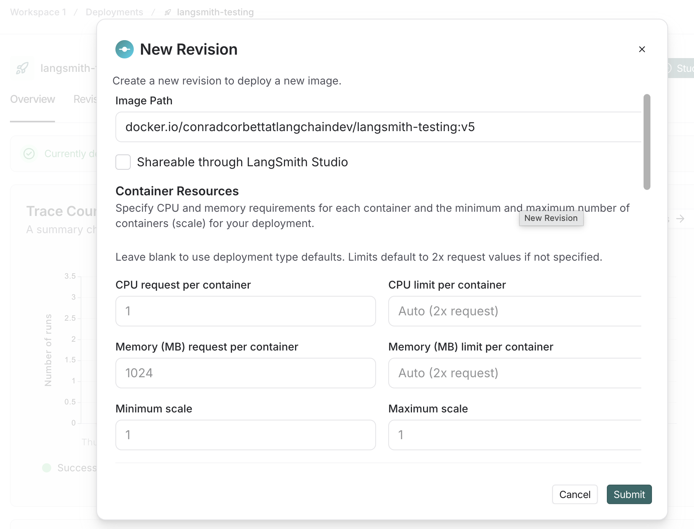

# Part 1: Building and Deploying Your Agent to LangSmith

## Introduction

LangSmith self-hosted supports deploying your agentic applications directly to the LangSmith platform. To deploy your agent to LangSmith Deployments (LSD), you need to build a Docker image of your agent. The LangGraph CLI makes this process straightforward.

In this lab, you'll:
1. Set up your local environment
2. Build a Docker image of your agent
3. Push the image to a container registry
4. Deploy the image to LangSmith

## Prerequisites

Before starting this lab, ensure you have:

- **Docker Account**: Create a free account at [Docker Hub](https://www.docker.com) and create a repository where you can push your image
  - Note: You can use another container registry (e.g., AWS ECR, GCR), but these instructions use Docker Hub
- **Docker Desktop**: Installed and running on your machine
- **LangSmith Account**: Access to a LangSmith instance with deployment permissions
- **uv**: Python package manager installed ([installation guide](https://github.com/astral-sh/uv))

## Step 1: Set Up Your Environment

Create a virtual environment and install the required dependencies:

```bash
uv venv --python 3.13.11
source .venv/bin/activate  # On Windows: .venv\Scripts\activate
uv pip install -r requirements.txt
```

## Step 2: Configure Environment Variables

Create a `.env` file based on the provided `.env.example`:

```bash
cp .env.example .env
```

Edit the `.env` file and add your API keys:
- `OPENAI_API_KEY`: Your OpenAI API key
- `LANGSMITH_API_KEY`: Your LangSmith API key
- `LANGSMITH_ENDPOINT`: Your LangSmith instance endpoint (if different from the example)

## Step 3: Build the Docker Image

Build your agent as a Docker image using the LangGraph CLI. Replace `<your-dockerhub-username>` with your actual Docker Hub username:

```bash
uv run langgraph build --platform linux/amd64 -t <your-dockerhub-username>/langsmith-lsd-101:v1
```

Verify the image was built successfully:

```bash
docker images | grep <your-dockerhub-username>/langsmith-lsd-101
```

You should see your newly built image listed with the `v1` tag.

## Step 4: Push the Image to Docker Hub

Log in to Docker Hub (if not already logged in):

```bash
docker login
```

Push your image to the registry:

```bash
docker push <your-dockerhub-username>/langsmith-lsd-101:v1
```

## Step 5: Verify Your Image

Confirm your image is available in your Docker Hub repository:
1. Go to [Docker Hub](https://hub.docker.com)
2. Navigate to your repository
3. Verify the `langsmith-lsd-101:v1` tag is present

## Step 6: Deploy to LangSmith

Now you're ready to create a deployment in LangSmith:

1. Log in to your LangSmith instance
2. Navigate to the **Deployments** tab
3. Click **Create Deployment**
4. Fill in the deployment details:
   - **Deployment Name**: Choose a descriptive name (e.g., `text2sql-agent`)
   - **Image URL**: Enter your full image path: `<your-dockerhub-username>/langsmith-lsd-101:v1`
   - **Environment Variables**: Add any required variables (make sure to add your OPENAI_API_KEY here.)
5. Click **Create**



Your agent is now deployed and ready to receive requests!

## Next Steps

Once your deployment is running, proceed to the notebook in the `notebooks/` folder to interact with your deployed agent and learn how to make API calls to it.

